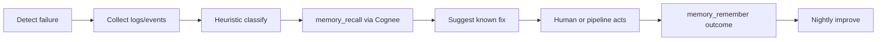

# kube-memory Server Foundation Plan

## Project Analysis

### What kube-memory is solving

DevOps teams already capture incidents, fixes, and deploy outcomes across Slack, GitHub, PagerDuty, and cluster telemetry — but that knowledge is siloed and invisible to AI agents, which reset every session. kube-memory closes the loop:



The product is the **persistent knowledge graph**, not a chat wrapper. Each episode follows an EHR-like model: Symptom → Diagnosis → Treatment → Outcome ([PLAN.md](PLAN.md) §3).

### What is solid today (build now)

| Area | Assessment |
|------|------------|
| Memory loop (remember/recall/forget/improve) | Real Cognee API; use `@cognee/cognee-ts` instead of hand-rolled REST ([PLAN.md](PLAN.md) §4.2 is slightly outdated — Cognee now ships an official TS client) |
| MCP scaffolding | `@modelcontextprotocol/sdk` + `@modelcontextprotocol/express` Streamable HTTP at `/mcp` |
| Heuristic failure taxonomy | Regex/keyword MVP for OOMKilled, CrashLoopBackOff, etc. ([PLAN.md](PLAN.md) §11) |
| Kubernetes read tools | `@kubernetes/client-node` — mirror tool shapes from [kubernetes-mcp-server](https://github.com/containers/kubernetes-mcp-server) (`pods_log`, `events_list`) |

### What to defer (per PLAN feasibility check)

- LLM root-cause classification beyond heuristics
- Auto-remediation (rollback/patch) — suggest-only first
- 18+ managed-platform connectors — Kubernetes + Cognee only for MVP
- Embedding the Go `kubernetes-mcp-server` binary — incompatible with Vercel serverless; reimplement read-only tools in Node instead
- Proxying through `cognee-mcp` as a sidecar — adds auth/release complexity; call Cognee Cloud directly from Express

### Architecture decision: two databases, two roles

```mermaid
flowchart TB
  subgraph clients [AI Clients]
    cursor[Cursor / Claude / VS Code]
    ci[CI pipelines]
  end

  subgraph vercel [Vercel - server/]
    mcp[MCP layer /mcp]
    rest[REST /status /ingest /memory]
    mongo[(MongoDB Atlas)]
  end

  subgraph cognee [Cognee Cloud]
    graph[Knowledge graph + vectors]
  end

  subgraph k8s [Kubernetes cluster]
    cluster[Pods / Events / Logs]
  end

  clients --> mcp
  clients --> rest
  mcp --> mongo
  rest --> mongo
  mcp --> graph
  rest --> graph
  mcp --> cluster
```

- **Cognee Cloud**: durable DevOps memory graph (Service, Incident, FixAction entities from [PLAN.md](PLAN.md) §10)
- **MongoDB Atlas**: platform/tenant metadata only — workspaces, API keys, connector configs, audit logs, ingestion job state. Do **not** duplicate the graph in Mongo.

### Cognee Cloud integration (updated from PLAN)

Use the official TypeScript client with cloud credentials:

```typescript
// server/src/services/cognee/client.ts
import { Cognee } from '@cognee/cognee-ts';

const cognee = new Cognee({
  baseUrl: process.env.COGNEE_BASE_URL!,  // e.g. https://your-tenant.aws.cognee.ai
  apiKey: process.env.COGNEE_API_KEY!,    // ck_...
});
```

Core operations map 1:1 to kube-memory tools:

| kube-memory tool | Cognee call | Notes |
|------------------|-------------|-------|
| `memory_remember` | `cognee.remember(structuredPayload, { datasetName })` | Serialize graph entities as JSON text; indexing is async |
| `memory_recall` | `cognee.recall(query, { datasets, topK })` | Built-in vector + graph routing |
| `memory_forget` | `cognee.forget({ dataset })` | Retention policy jobs |
| nightly improve | `cognee.improve({ dataset, sessionIds })` | Vercel Cron → `/api/cron/improve` |

**Operational caveat** (PLAN §12): `remember()` may return before indexing completes; recall during the same incident may miss very recent entries. Track ingestion status in Mongo `MemoryEventRecord.status`.

Environment variables (never committed):

```dotenv
COGNEE_BASE_URL=
COGNEE_API_KEY=
MONGODB_URI=
KUBECONFIG_BASE64=          # optional; base64-encoded kubeconfig for k8s tools
API_KEY_SALT=               # for hashing workspace API keys
```

---

## Server Folder Structure

Create [`server/`](server/) as a standalone TypeScript Express app deployable to its own Vercel project (Root Directory = `server`).

```
server/
├── package.json
├── tsconfig.json
├── vercel.json
├── .env.example
├── scripts/
│   └── should-deploy.sh          # deploy-prefix gate for ignoreCommand
└── src/
    ├── index.ts                  # export default Express app (Vercel entry)
    ├── app.ts                    # middleware, route mounting
    ├── config/env.ts             # Zod-validated env
    ├── db/
    │   ├── connection.ts         # cached Mongoose connect (serverless-safe)
    │   └── models/
    │       ├── Workspace.ts
    │       ├── Connector.ts
    │       ├── ApiKey.ts
    │       ├── AuditLog.ts
    │       └── MemoryEventRecord.ts
    ├── schemas/                  # Zod — shared validation layer
    │   ├── graph/                # PLAN §10 entities
    │   │   ├── service.ts
    │   │   ├── deployment.ts
    │   │   ├── incident.ts
    │   │   ├── rootCause.ts
    │   │   ├── fixAction.ts
    │   │   ├── person.ts
    │   │   ├── commit.ts
    │   │   ├── configuration.ts
    │   │   ├── errorLogSnippet.ts
    │   │   ├── metricsObservation.ts
    │   │   └── relations.ts      # hasDeployment, resolvedBy, etc.
    │   ├── api/
    │   │   ├── ingest.ts
    │   │   └── memoryQuery.ts
    │   └── mcp/
    │       └── toolInputs.ts     # JSON schemas for each MCP tool
    ├── services/
    │   ├── cognee/client.ts
    │   ├── memory/{remember,recall,forget}.ts
    │   ├── classification/heuristics.ts
    │   └── kubernetes/client.ts
    ├── mcp/
    │   ├── server.ts             # McpServer + tool registration
    │   └── tools/{memory,kubernetes}.ts
    ├── routes/
    │   ├── health.ts             # GET /health
    │   ├── status.ts             # GET /status
    │   ├── ingest.ts             # POST /ingest
    │   └── memory.ts             # POST /memory/query
    └── middleware/
        ├── auth.ts               # Bearer km_* API key
        └── errorHandler.ts
```

### MongoDB schemas (Mongoose)

**Workspace** — tenant isolation, maps to Cognee dataset

| Field | Type | Purpose |
|-------|------|---------|
| `slug` | string, unique | URL-safe workspace id |
| `name` | string | Display name |
| `cogneeDataset` | string | Default `main_dataset` or per-workspace dataset |
| `retentionDays` | number | TTL for forget jobs |
| `createdAt/updatedAt` | dates | Audit |

**Connector** — per-integration config (secrets stored as env refs, not plaintext in DB)

| Field | Type | Purpose |
|-------|------|---------|
| `workspaceId` | ObjectId | FK |
| `type` | enum: `kubernetes`, `github`, `slack`, ... | Connector kind |
| `enabled` | boolean | Toggle |
| `config` | Mixed (validated by Zod per type) | Non-secret settings (namespace, repo) |
| `secretRef` | string | Vercel env key name, e.g. `WORKSPACE_abc_K8S_TOKEN` |
| `healthStatus` | enum | `healthy`, `degraded`, `error` |

**ApiKey** — MCP/REST auth ([PLAN.md](PLAN.md) §16)

| Field | Type | Purpose |
|-------|------|---------|
| `workspaceId` | ObjectId | Scope |
| `keyHash` | string | bcrypt/scrypt hash of `km_...` token |
| `prefix` | string | First 8 chars for lookup |
| `role` | enum: `reader`, `admin` | RBAC |
| `expiresAt` | date | Optional rotation |

**AuditLog** — every tool call attributable

| Field | Type | Purpose |
|-------|------|---------|
| `workspaceId`, `apiKeyId` | ObjectId | Who |
| `tool`, `input`, `outcome` | string/Mixed | What |
| `durationMs` | number | Latency tracking |

**MemoryEventRecord** — local mirror for async Cognee indexing

| Field | Type | Purpose |
|-------|------|---------|
| `workspaceId` | ObjectId | Scope |
| `cogneeDataset` | string | Target dataset |
| `payload` | Mixed | Serialized graph episode |
| `status` | enum: `pending`, `indexed`, `failed` | Indexing lifecycle |
| `failureCategory` | string | Heuristic taxonomy label |

### Graph entity Zod schemas (PLAN §10)

These live in `server/src/schemas/graph/` and are used to:

1. Validate `/ingest` REST payloads
2. Serialize structured JSON passed to `cognee.remember()`
3. Define MCP tool input schemas

Example episode shape stored in Cognee:

```typescript
// Incident episode passed to remember()
{
  entity: 'Incident',
  service: { name: 'payment-service', team: 'payments', criticality: 'high' },
  deployment: { timestamp: '...', imageTag: 'v1.2.3', namespace: 'prod' },
  incident: { severity: 'P1', status: 'resolved', time: '...' },
  rootCause: { category: 'Resource Limit', description: 'OOMKilled' },
  fixAction: { type: 'config-change', description: 'Raised memory limit to 512Mi' },
  relations: ['Service-hasDeployment-Deployment', 'Incident-resolvedBy-FixAction']
}
```

### MCP tools — Phase 1 registry

Implement now (functional, not stubs):

- `memory_remember`, `memory_recall`, `memory_forget`
- `predict_risk` — thin wrapper: recall + similarity threshold → `{ score, reason }`

Stub with schema + "not configured" response (Phase 2):

- `k8s_pod_logs`, `k8s_get_events`

Register via `@modelcontextprotocol/server` on Streamable HTTP:

```typescript
// server/src/index.ts pattern (Vercel-compatible)
import { createMcpExpressApp } from '@modelcontextprotocol/express';
import { NodeStreamableHTTPServerTransport } from '@modelcontextprotocol/node';

const app = createMcpExpressApp();
app.use(express.json());
// mount REST routes + POST /mcp
export default app;
```

Use **stateless** transport (`sessionIdGenerator: undefined`) — matches Vercel serverless and kubernetes-mcp-server's `--stateless` guidance.

### Key dependencies

```json
{
  "dependencies": {
    "@cognee/cognee-ts": "latest",
    "@kubernetes/client-node": "^1",
    "@modelcontextprotocol/express": "latest",
    "@modelcontextprotocol/node": "latest",
    "@modelcontextprotocol/server": "latest",
    "express": "^5",
    "mongoose": "^8",
    "zod": "^3",
    "prom-client": "^15"
  }
}
```

---

## Vercel Deployment Setup

Two separate Vercel projects from the monorepo:

| Project | Root Directory | Framework |
|---------|----------------|-----------|
| kube-memory-client | `client/` | Vite (static) |
| kube-memory-server | `server/` | Express (zero-config) |

### [`server/vercel.json`](server/vercel.json)

```json
{
  "$schema": "https://openapi.vercel.sh/vercel.json",
  "ignoreCommand": "bash scripts/should-deploy.sh",
  "functions": {
    "src/index.ts": { "maxDuration": 60 }
  },
  "crons": [{ "path": "/api/cron/improve", "schedule": "0 3 * * *" }]
}
```

### [`client/vercel.json`](client/vercel.json)

```json
{
  "$schema": "https://openapi.vercel.sh/vercel.json",
  "ignoreCommand": "bash scripts/should-deploy.sh",
  "buildCommand": "npm run build",
  "outputDirectory": "dist",
  "framework": "vite"
}
```

### Deploy gate script (both projects)

[`scripts/should-deploy.sh`](scripts/should-deploy.sh) at repo root, symlinked or copied into each project:

```bash
#!/usr/bin/env bash
# Exit 1 = build proceeds; Exit 0 = skip (Vercel cancels deployment)
if echo "${VERCEL_GIT_COMMIT_MESSAGE:-}" | grep -qiE '^deploy'; then
  exit 1
fi
exit 0
```

This satisfies: **no deploy on normal commits; deploy only when message starts with `deploy`** (e.g. `deploy: server phase 1`, `deploy client dashboard`).

> Note: Git pushes still create a deployment entry in Vercel, but non-`deploy` commits show status **Canceled (Ignored Build Step)**. For completely silent git integration, set `"git": { "deploymentEnabled": false }` and rely solely on GitHub Actions — but the `ignoreCommand` approach matches your stated requirement without needing Deploy Hooks.

---

## GitHub Actions Workflows

Create [`.github/workflows/`](.github/workflows/):

### `ci-server.yml` — lint + typecheck on every PR/push touching `server/**`

- Node 22, `npm ci`, `npm run typecheck`, `npm run lint`
- Optional: mock Cognee in unit tests with `nock`

### `ci-client.yml` — same for `client/**`

### `deploy-server.yml` — production deploy gate

```yaml
on:
  push:
    branches: [main]
    paths: ['server/**', '.github/workflows/deploy-server.yml']
jobs:
  deploy:
    if: startsWith(github.event.head_commit.message, 'deploy')
    runs-on: ubuntu-latest
    steps:
      - uses: actions/checkout@v4
      - uses: amondnet/vercel-action@v25
        with:
          vercel-token: ${{ secrets.VERCEL_TOKEN }}
          vercel-org-id: ${{ secrets.VERCEL_ORG_ID }}
          vercel-project-id: ${{ secrets.VERCEL_SERVER_PROJECT_ID }}
          working-directory: server
          vercel-args: '--prod'
```

### `deploy-client.yml` — mirror with `VERCEL_CLIENT_PROJECT_ID` and `working-directory: client`

Required GitHub secrets: `VERCEL_TOKEN`, `VERCEL_ORG_ID`, `VERCEL_SERVER_PROJECT_ID`, `VERCEL_CLIENT_PROJECT_ID`.

---

## Implementation Sequence (Phase 1 MVP)

Follow [PLAN.md](PLAN.md) §20 Phase 1 deliverables:

1. **Scaffold** `server/` package, TypeScript, Express entry, env validation, health route
2. **Mongo** — Mongoose models + connection helper + indexes on `Workspace.slug`, `ApiKey.prefix`
3. **Schemas** — all graph entity Zod types + MCP tool input schemas
4. **Cognee client** — wrap `@cognee/cognee-ts`; implement remember/recall/forget services
5. **REST** — `POST /ingest`, `POST /memory/query`, `GET /status` with API-key auth
6. **MCP** — register memory tools on `/mcp`; wire to Cognee services
7. **Heuristics** — `classification/heuristics.ts` for failure taxonomy (OOMKilled, CrashLoopBackOff, etc.)
8. **Vercel + CI** — both `vercel.json` files, deploy script, four GitHub workflows
9. **Smoke test** — remember a synthetic CrashLoopBackOff incident, recall it, verify round-trip

### Verification checklist

- `npm run dev` locally with `.env` + MongoDB Atlas
- `curl /health` returns 200
- MCP Inspector connects to `http://localhost:3000/mcp`
- `memory_remember` → `memory_recall` returns the stored incident
- Commit `fix: something` → Vercel build skipped
- Commit `deploy: server smoke test` → Vercel build runs

---

## Risks to track early

| Risk | Mitigation |
|------|------------|
| Cognee indexing latency | `MemoryEventRecord.status` + surface "indexing" in MCP responses |
| Vercel cold starts on recall | LRU cache in memory service for hot queries (PLAN §17) |
| Kubeconfig on Vercel | Store base64 kubeconfig or token in Vercel env; read-only RBAC |
| Bundle size (250MB limit) | Tree-shake; defer heavy connectors |
| `@cognee/cognee-ts` API drift | Pin version; thin wrapper in `services/cognee/client.ts` |
